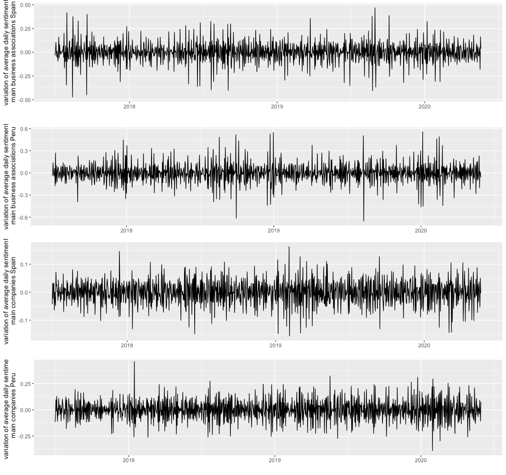
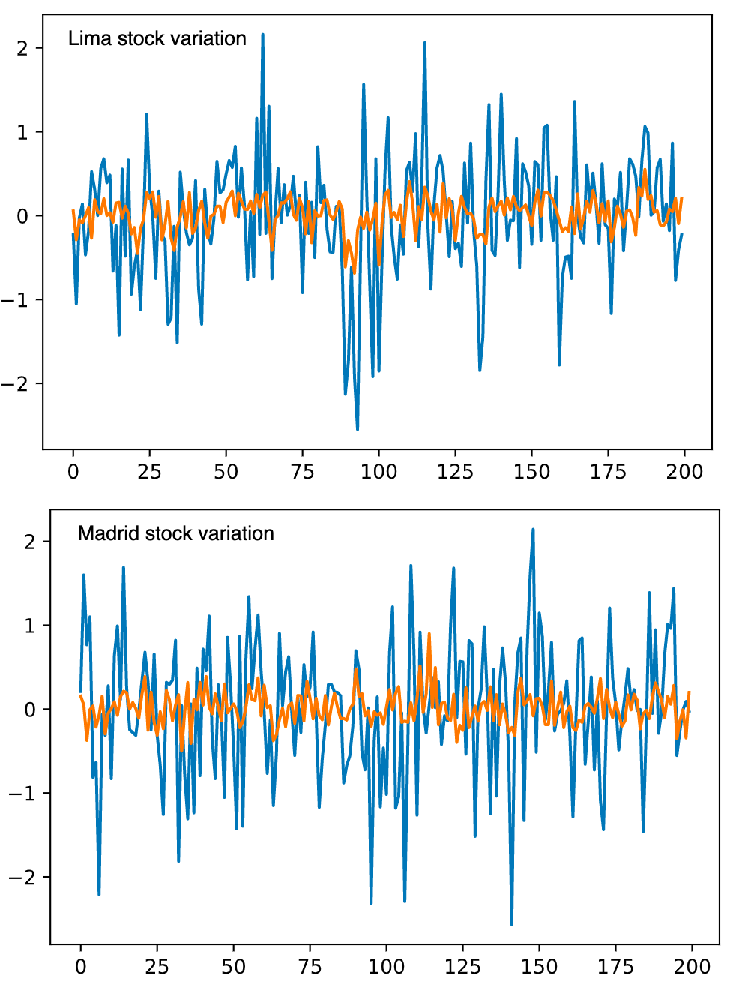

# Methods

## Data extraction

For the consecution of this project we extracted 
* 120K tweets from the 40 main business association accounts in Spain
* 269K tweets from the 35 main companies (ibex 35) in Spain
* 17K tweets from the 30 main business association accounts in Peru
* 72K tweets from the 20 main companies in Peru

These tweets cover the period dated from january 2017 to march 2020.

In order to train a spanish sentiment analysis neural network we also extracted 100K rated user reviews. This reviews covered very variated items such as films, products and places and were extracted using *web crawling* software in public websites.

## Spanish sentiment analysis neural networks training using reviews data
Using the 100K rated reviews in spanish we separated them in two groups: *positive reviews* and *negative reviews*. Since there were more positive than negative reviews, we balanced the two classes removing enough positive ones to have the same size in both groups.

For the neural network architecture  we used an embedding layer, four convolutional (1 dimensional) layers, two poolings and a one dimensional output dense layer. Other architectures were tried, but we obtained poorer results in terms of validation accuracy.

|data |accuracy | precission  | recall  |
|-|-|-|-|-|
|training data| 0.9988  | 0.9991  |  0.9992 |  
|test data (validation) | 0.9869  |  0.9840 |  0.9870 

## Tweets processing using sentiment analysis

Using the neural network sentiment model described in the previous section, we proceed with the analysis and of the tweets from the business associations and companies using the following steps:

1. We run the sentiment analysis on each tweet. This gives us a number between 0 and 1 expressing the positivity or negativity of the tweet.
2. We calculate the average of all the tweets published in the same day in each group.
3. We calculate the difference between the average sentiment in each given day and the day before to remove the trend component and make the data more comparable.

This transforms the data into a time series that we can study and compare to macro economic data. In particular we obtain four time series: daily sentiment of main comanies and business associations both in Spain and Peru.

The four time series are the starting point in our analysis and modeling process. See figure 1

 
**figure 1**

# Results

## Prediction of Madrid and Lima stocks change using traditional models

We use the daily average sentiment data described in the previous section to predict the fluctuations of stock values.

First, we see that the daily average sentiment is a stationary time series. This are the p-values of the Dicker-Fuller test for the four time series
|p-value| results daily variation sentiment business asociation| results daily variation sentiment main companies|
|-|-|-|
|Spain|3.541674e-23|3.280194e-26 |
|Peru|0.000116|0.002758 |

So we obtain that the four time series are stationary. 

Using a VAR model to predict the variation of stocks change one day in advance from the variation in the sentiment both for business associations and companies, we obtain a MAE (mean absolute error) of 0.8735 for Spain and 0.5212 for Peru

Nevertheless, we see that there is a great volatility in the months of COVID-19 pandemic, so removing those three months (february, march and april 2020) we see that the model performs much better in terms of MSE: 0.6931 for Spain and 0.5101 for Peru.

figure 2 shows the sock values (removing the pandemic months) in blue and the prediction in orange.

 

<!--
Which means that we are in the conditions of studying Granger causality and VAR models.

This are the p-values of the Granger causality test of the daily variation of sentiment and the prize change in the stock value (Madrid and Lima respectively)

 
|p-value| variation sentiment business association vs variation stock prize|  variation sentiment main companies vs variation stock prize|
|-|-|-|
|Spain|0.8397|0.0959 |
|Peru|0.1877|0.3463 |

As we see, this high p-values do not allow us to conclude that there is causality. Nevertheless, considering only the data before the covid pandemic (prior to february 2020), we get the following p-values in the Granger causality test

|p-value| variation sentiment business association vs variation stock prize|  variation sentiment main companies vs variation stock prize|
|-|-|-|
|Spain|0.0574|0.3672 |
|Peru|0.4971|0.2922 |
-->

## Prediction of Madrid and Lima stocks change using neural networks models

Neural network models present a different approach to forecasting time series. We compare LTSM neural networks and Convolutional neural network models.

The model forecasts a day in advance using a window of the previous

||LSTM mean absolute error|Convolutional networks mean absolute error|
|-|-|-|
|Madrid stocks|0.7061|0.8172
|Lima stocks  |0.7529| 0.6754

As we did with the VAR models, due to the high volatility during the COVID months, it makes sense to repeat the training of the model using only the data from the months prior to the pandemic. This are the results obtained

||LSTM mean absolute error|Convolutional networks mean absolute error|
|-|-|-|
|Madrid stocks|0.5030| 0.6908
|Lima stocks  |0.5459| 0.5576

